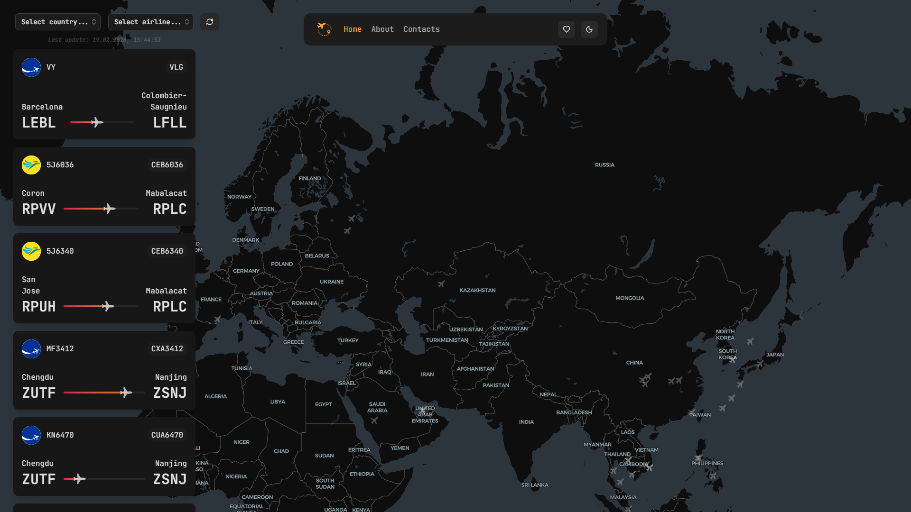
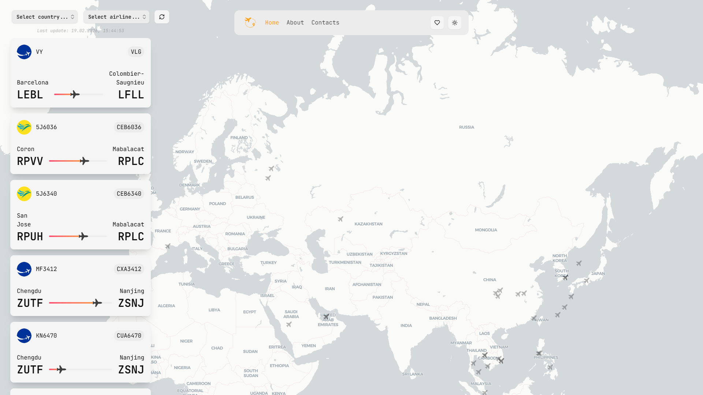
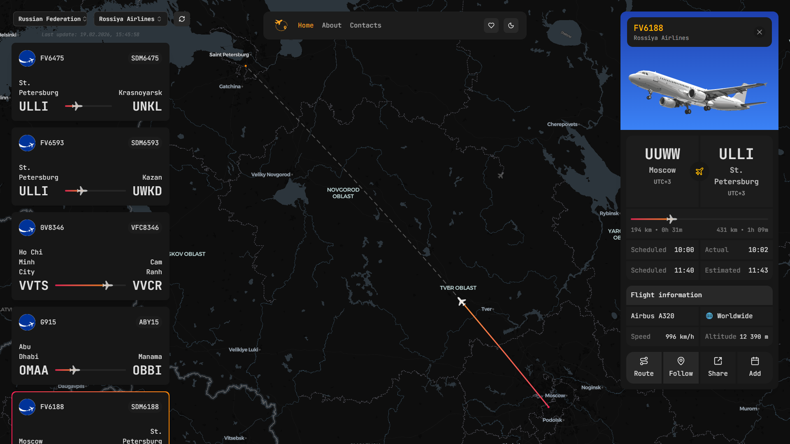
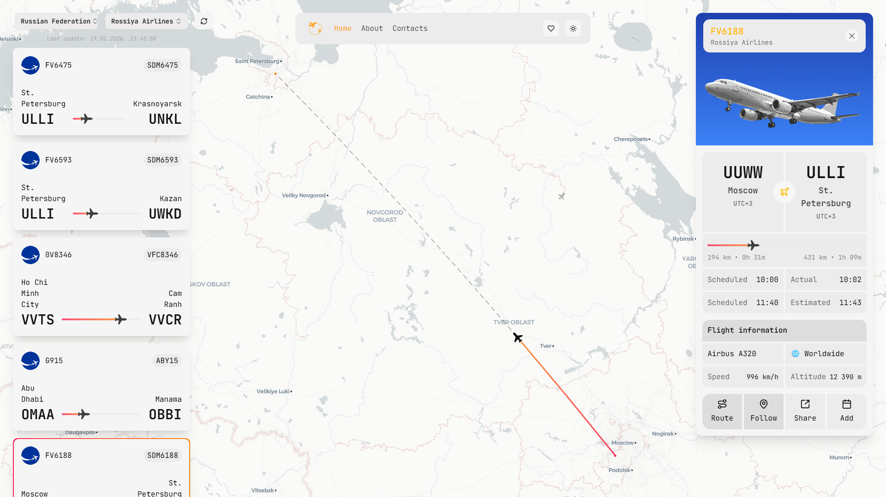
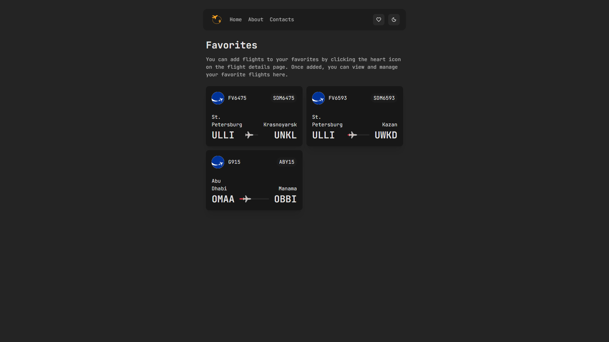
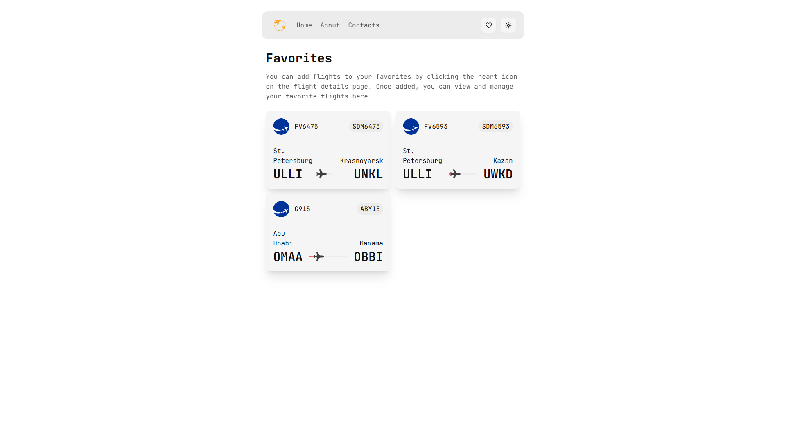
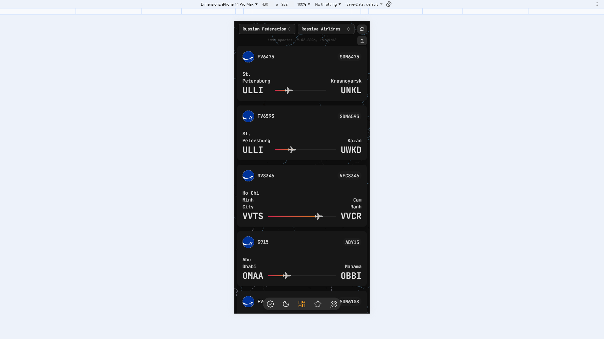
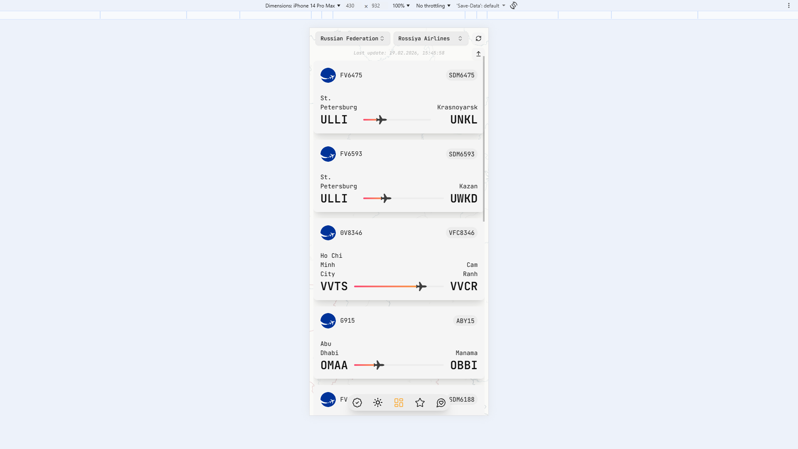
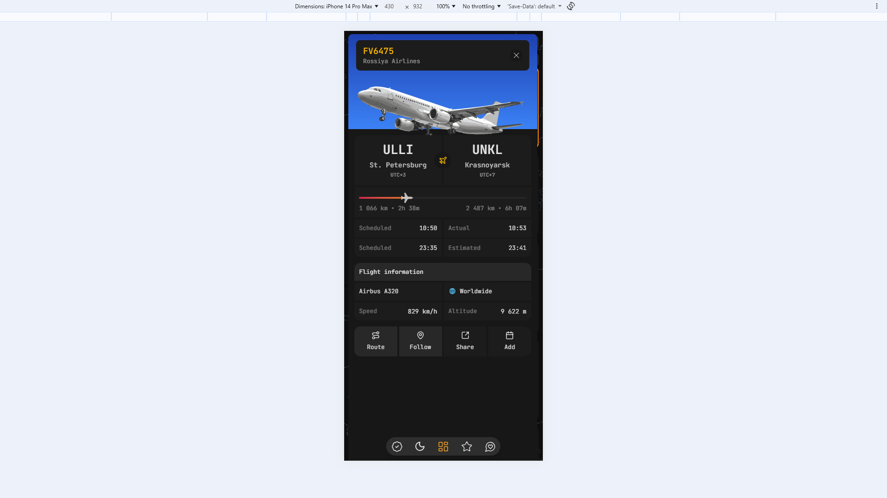
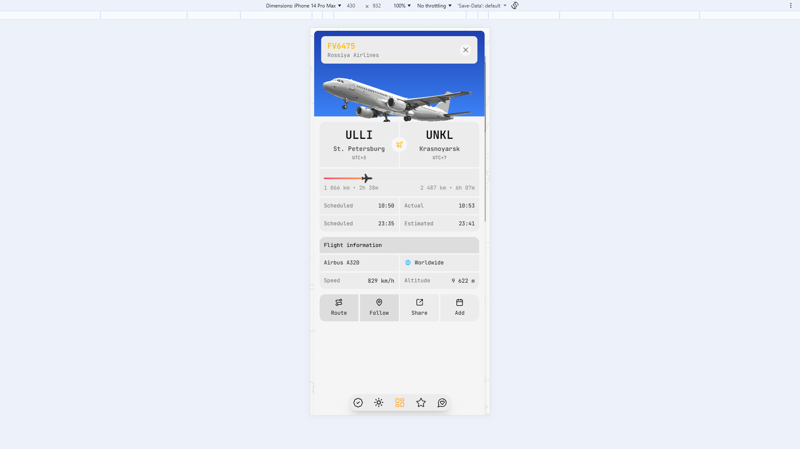

# Sky Track

**Sky Track** is a flight search and tracking app with route details, schedule, interactive map, and calendar export.

---

## 🧰 Tech Stack

### Frontend

* **Vite** — dev server and build tooling
* **React 19** — UI
* **TypeScript** — static typing
* **React Router** — routing
* **Redux Toolkit** — app state (favorites, actions)
* **@tanstack/react-query + tRPC** — typed API layer and caching
* **Tailwind CSS v4** — styling
* **Radix UI** — UI primitives (Dialog / Select / Popover)
* **Framer Motion / Motion** — animations
* **MapLibre GL + react-map-gl** — map rendering
* **Turf.js** — geo calculations
* **Sonner** — toasts

### Backend

* **Bun** — runtime and package manager
* **Express** — HTTP server
* **tRPC** — API router
* **Zod** — validation
* **Axios** — HTTP client
* **SuperJSON** — serialization
* **dotenv** — env config
* **i18n-iso-countries** — countries data

### Tooling & QA

* **ESLint** — linting
* **Prettier** — formatting
* **Vitest** — unit/integration tests
* **Cypress** — E2E tests

---

## 📸 Screenshots

This gallery showcases the project interface.

#### Home (dark)



#### Home (light)



#### Route details (dark)



#### Route details (light)



#### Favorites (dark)



#### Favorites (light)



#### Mobile — routes list (dark)



#### Mobile — routes list (light)



#### Mobile — route details (dark)



#### Mobile — route details (light)



---

## ⚙️ Development

### Requirements

* **Node.js**: `v22.14.0`
* **Bun**: `v1.3.5`

### Install

```bash
bun install
```

### Environment variables

#### Backend — `backend/.env`

```env
AVIATIONSTACK_API_TOKEN=YOUR_TOKEN
```

Create a token at:

* [https://aviationstack.com/](https://aviationstack.com/)

#### Frontend — `.env`

```env
VITE_BACKEND_URL=http://localhost:5174
VITE_API_TOKEN=YOUR_TOKEN
```

> `VITE_API_TOKEN` should be the same token used by the backend.

### Run (frontend + backend)

```bash
bun run dev
```

This command runs:

* Frontend (Vite): `bun run dev:front`
* Backend (Bun): `bun run dev:back`

### Run separately

Frontend:

```bash
bun run dev:front
```

Backend:

```bash
bun run dev:back
```

### Build & preview

Build:

```bash
bun run build
```

Preview:

```bash
bun run preview
```

---

## 🧪 Tests

Unit tests:

```bash
bun run test
```

Run tests once:

```bash
bun run test:run
```

UI mode:

```bash
bun run test:ui
```

Coverage:

```bash
bun run test:coverage
```

E2E (Cypress):

```bash
bunx cypress open
```

---

## 📝 License

This project is licensed under the MIT License.

---

**License:** MIT
**Author:** [Alexey Alan-Reys](https://github.com/alexey-alanreys)
